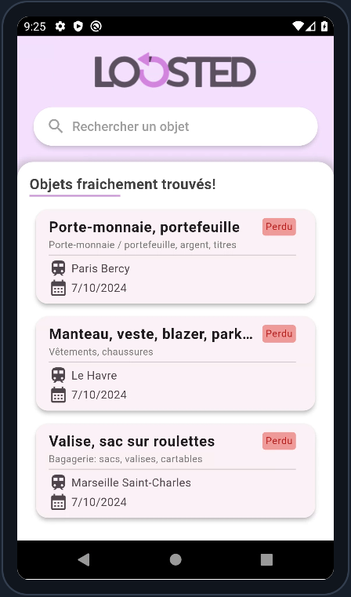
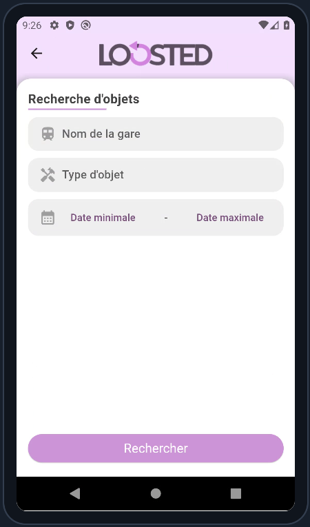

# SNCF Objets Trouvés

Une application Flutter permettant de rechercher et visualiser les objets trouvés dans les gares SNCF à partir des données ouvertes de la SNCF. L'application propose plusieurs fonctionnalités comme la recherche par type d'objet, gare, et date avec un affichage des résultats triés par date décroissante.

## Fonctionnalités

- **Rechercher des objets trouvés** par gare, type d'objet, et date.
- **Auto-complétion** dans les champs de recherche pour faciliter la sélection des gares et des types d'objets.
- **Affichage des résultats** avec la possibilité de voir les détails d'un objet trouvé.
- **Tri par date décroissante** pour visualiser les objets les plus récemment trouvés.

## Captures d'écran





## Installation

1. **Clone le dépôt** sur votre machine locale :

   ```bash
   git clone https://github.com/Grand0x/SNCF-Object-Found.git
   ```

2. **Accédez au répertoire du projet** :

   ```bash
   cd sncf-objets-trouves
   ```

3. **Installez les dépendances** Flutter :

   ```bash
   flutter pub get
   ```

4. **Lancez l'application** :

   ```bash
   flutter run
   ```

## API utilisée

Les données sur les objets trouvés proviennent de l'API ouverte de la SNCF :

- [SNCF API - Objets Trouvés Restitution](https://data.sncf.com/explore/dataset/objets-trouves-restitution/api/)

L'API fournit des informations sur les objets trouvés dans les gares SNCF, avec la possibilité de filtrer les résultats par gare, type d'objet, et date.

## Structure du projet

- **`lib/`** : Contient les fichiers principaux de l'application Flutter.
  - **`models/`** : Contient les classes représentant les objets du dataset (`FoundObject`).
  - **`services/`** : Contient le service `SncfData` pour gérer les appels à l'API.
  - **`widgets/`** : Contient les widgets personnalisés utilisés dans l'application (`CustomTextInput`, `CustomDatePicker`).
  - **`pages/`** : Contient les différentes pages de l'application (recherche, affichage des résultats, etc.).
  
### Exemple de structure de fichiers

```plaintext
.
├── lib/
│   ├── models/
│   │   └── found_object.dart
│   ├── services/
│   │   └── sncf_data.dart
│   ├── widgets/
│   │   ├── custom_text_input.dart
│   │   ├── custom_date_picker.dart
│   ├── pages/
│   │   ├── search_page.dart
│   │   ├── found_objects_list.dart
│   └── main.dart
```

## Utilisation

### Rechercher des objets trouvés

1. **Recherche par gare et type d'objet** : L'application propose des champs de recherche avec auto-complétion pour faciliter la sélection des gares et des types d'objets.
2. **Sélection de la date** : Un widget de sélection de date permet de filtrer les résultats par une plage de dates (date min et max).
3. **Affichage des résultats** : Les objets trouvés sont affichés sous forme de liste, triés par date décroissante.
4. **Détails d'un objet** : En cliquant sur un élément de la liste, vous pouvez voir les détails de l'objet trouvé.

### Exemple d'appel API

Voici un exemple d'appel d'API pour rechercher des objets trouvés dans une gare spécifique, triés par date :

```dart
final List<FoundObject> results = await SncfData().searchFoundObjects(
  stationName: 'Paris Gare de Lyon',
  objectType: 'Bagagerie',
  dateMin: DateTime(2023, 01, 01),
  dateMax: DateTime(2023, 12, 31),
);
```

## Contribuer

Les contributions sont les bienvenues ! Si vous souhaitez améliorer ce projet, voici comment vous pouvez contribuer :

1. **Fork le projet**
2. **Créez une branche de fonctionnalité** (`git checkout -b feature/ma-fonctionnalite`)
3. **Committez vos changements** (`git commit -m 'Ajout de ma fonctionnalité'`)
4. **Poussez votre branche** (`git push origin feature/ma-fonctionnalite`)
5. **Ouvrez une Pull Request**

## License

Ce projet est sous licence MIT. Voir le fichier [LICENSE](LICENSE) pour plus de détails.

## Remerciements

- Merci à la **SNCF** pour la publication des données ouvertes sur les objets trouvés.
- Inspiré par la simplicité de l'intégration des API ouvertes avec Flutter.